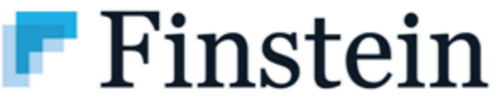
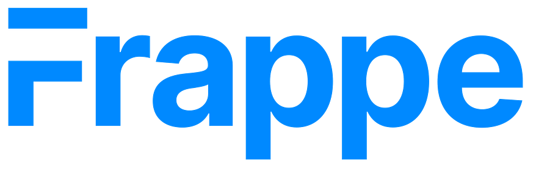
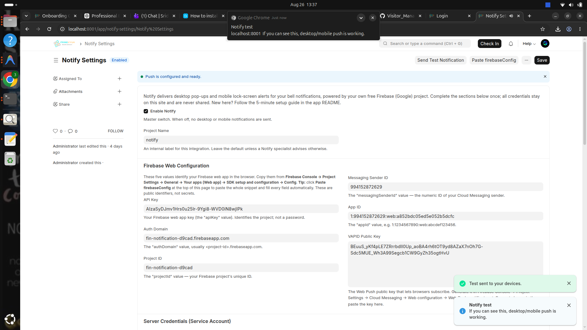
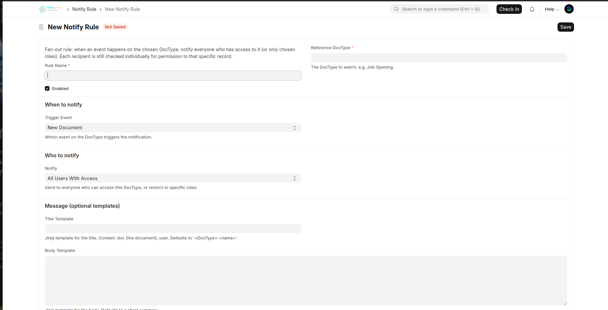
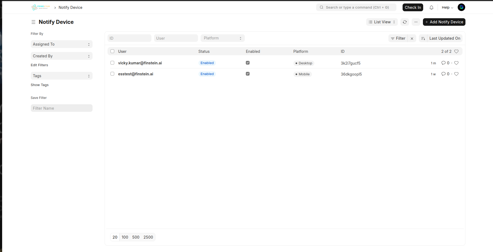
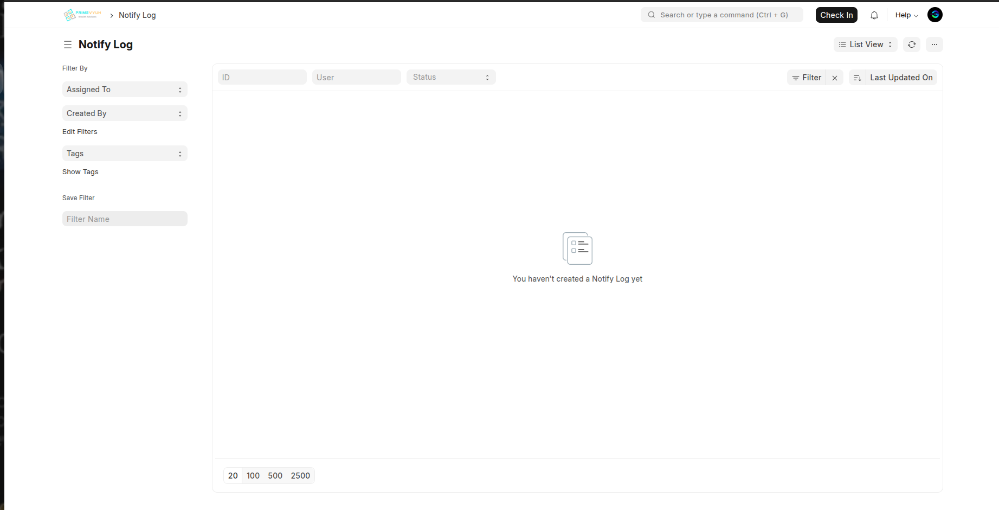

<div style="display: flex; justify-content: space-between; margin-bottom: 20px;">
    
    
</div>

---

# Notify

Outlook-style desktop pop-ups and mobile lock-screen push for any Frappe/ERPNext site — driven by the standard bell notifications. Every Notification Log (mentions, assignments, approvals, workflow actions) reaches the user's registered desktop browsers and, on Frappe HR (HRMS), their phone's lock screen. All powered by your own Firebase project — no external relay, no per-message cost. Built on Frappe & ERPNext.

Frappe 16  ·  HRMS 16 (optional)  ·  Python 3.14  ·  license MIT

> **This is the `version-16` branch** — targets Frappe/ERPNext v16 (Python 3.14). For v15, use the `main` branch.

---

## Main features

**Desktop push from bell notifications:** Every Frappe Notification Log — mentions, ToDo assignments, approvals, workflow actions — becomes an Outlook-style desktop pop-up at the top of the screen, even when the Desk tab is unfocused or closed, with an optional sound. Works on any Frappe app (ERPNext, LMS, HR, custom apps).

**Mobile / ESS lock-screen push:** With Frappe HR (HRMS) installed, the same notifications reach employees' phones as native lock-screen push through the Frappe HR (ESS) PWA. Notify intercepts the ESS relay endpoints and drives them against your own Firebase engine — **no external relay service and no modification to HRMS**.

**Self-hosted, zero per-message cost:** All delivery runs on your own free Firebase Cloud Messaging project. Paste your Firebase web config, VAPID key, and service-account JSON into **Notify Settings** — there is no third-party relay in the path and no per-notification fee.

**Targeted rules engine:** Beyond mirroring every bell notification, **Notify Rule** lets you push on specific doctype events (New Document, On Update, On Submit, Workflow State Reached), target *all users with access* or *users with specific roles*, and compose the title, body, and link from Jinja templates.

**Device registry & delivery audit:** Each registered browser or phone is a **Notify Device** row (platform, token, last seen); every send is recorded in **Notify Log** with its status, channel, device count, and any error — a full audit of what was pushed to whom.

**Quiet hours, custom sound & cleanup:** Suppress push during a nightly window, play a custom sound on the desktop foreground toast, and auto-remove stale device tokens daily.

## How to Install

```bash
cd ~/frappe-bench
bench get-app --branch version-16 https://github.com/finstein-erpnext/Notify.git
bench --site <your-site> install-app notify
bench --site <your-site> migrate
bench build
bench restart
```

**Upgrade later:**

```bash
cd ~/frappe-bench/apps/notify
git pull
cd ~/frappe-bench
bench --site <your-site> migrate
```

The site must be served over **HTTPS** — Web Push requires it (`localhost` is fine for local testing).

---

## Setup and Use

All configuration lives in a single doctype: **Notify Settings**. Open the desk Awesome Bar and type "Notify Settings".

<p align="center"></p>
<p align="center"><em>Notify Settings — Firebase config, "Push is configured and ready", with a live desktop test pop-up</em></p>

### Connect your Firebase project

1. Create a free Firebase project at <https://console.firebase.google.com>.
2. **Web config** — Project Settings → General → *Your apps* → add a **Web app** → *SDK setup and configuration → Config*. Copy the `firebaseConfig` object and use the **Paste firebaseConfig** button on the form, or enter the fields by hand (see the table below).
3. **VAPID key** — Project Settings → **Cloud Messaging** → *Web Push certificates* → **Generate key pair** → paste into **VAPID Public Key**.
4. **Service account** — Project Settings → **Service accounts** → **Generate new private key** → paste the whole JSON into **Service Account JSON**.
5. Click **Save**. The form shows a green *"Push is configured and ready"* banner. Use **Send Test Notification** to verify.

| Field | What to put |
|---|---|
| **Enable Notify** | ✅ to turn the push engine on |
| **API Key / Auth Domain / Project ID / Messaging Sender ID / App ID** | From your Firebase **web app** config (auto-filled by *Paste firebaseConfig*) |
| **VAPID Public Key** | Web Push certificate key pair from Cloud Messaging |
| **Service Account JSON** | Full private-key JSON from Service accounts (used for server-side send) |
| **Push All Bell Notifications** | ✅ to mirror every Notification Log; untick to push only via **Notify Rule** |
| **Play Sound / Custom Sound** | Play a sound on the desktop pop-up; optionally upload an mp3/wav |
| **Enable Mobile / ESS Push** | ✅ to turn on lock-screen push through the Frappe HR (ESS) app |
| **Public Site URL** | HTTPS URL employees use, required for mobile/ESS push |
| **Respect Quiet Hours + Start / End** | Suppress push during the given window |
| **Remove Inactive Devices After (days)** | Daily cleanup of unused device tokens |

Click **Save**. The app is now configured.

---

## Enable desktop notifications — per user

1. The user opens the Desk; a prompt offers to **Enable desktop notifications** (or run `frappe.notify.enable()` in the browser console).
2. On **Allow**, the browser is registered as a **Notify Device**.
3. From then on, every bell notification for that user arrives as a desktop pop-up — even when the tab is unfocused or closed, as long as the browser is running.

## Enable mobile push — Frappe HR / ESS

Requires **HRMS** installed.

1. In **Notify Settings**, tick **Enable Mobile / ESS Push** and set **Public Site URL**.
2. Employees open the Frappe HR app and install it to the home screen.
3. In the app, toggle **Settings → Enable Push Notifications** — the phone registers as a **Notify Device** (platform *Mobile*).
4. Bell notifications now arrive on the phone's lock screen.

## Targeted rules — Notify Rule

Use a **Notify Rule** when you want to push on a specific document event instead of (or in addition to) mirroring every bell notification.

<p align="center"></p>
<p align="center"><em>Notify Rule — fan-out on a DocType event, targeted by access or role, with Jinja templates</em></p>

1. Open the desk Awesome Bar and type "Notify Rule", then **+ Add Notify Rule**.
2. Fill the fields below and tick **Enabled**.
3. Click **Save**. Matching events now fire a push composed from your templates.

| Field | What to put |
|---|---|
| **Rule Name** | A label for the rule (used as the record name) |
| **Reference DocType** | The doctype to watch (e.g. Sales Order, Leave Application) |
| **Trigger Event** | New Document / On Update / On Submit / Workflow State Reached |
| **Workflow State** | The state to match, when the trigger is *Workflow State Reached* |
| **Notify** | All Users With Access, or Users With Specific Roles |
| **Roles** | The roles to fan out to, when notifying by role |
| **Title / Body / Link Template** | Jinja templates rendered against the document |
| **Play Sound** | ✅ to play a sound on the desktop pop-up for this rule |

---

## Track every push

Delivery is captured across two doctypes:

| Doctype | Captures |
|---|---|
| **Notify Device** | Each registered browser/phone — user, platform (Desktop / Mobile / Native), FCM token, user agent, last seen. Toggle **Enabled** to pause a device without deleting it. |
| **Notify Log** | Every send attempt — user, status (Queued / Sent / Skipped / Failed), channel (Both / Desktop / Mobile), device count, title/body/link, linked reference document, and any error. |

<p align="center"></p>
<p align="center"><em>Notify Device — one row per registered browser/phone, showing platform and status</em></p>

<p align="center"></p>
<p align="center"><em>Notify Log — an audit row for every push attempt, filterable by user and status</em></p>

---

## Limitations

- **Desktop pop-ups** appear only while the browser is running (the tab may be closed). A toast with no browser at all would need a native tray agent, which is out of scope.
- **iOS web push** requires the PWA installed to the home screen (iOS 16.4+).
- **Custom sound** applies to the desktop foreground toast only; background and mobile push use the OS notification sound — a browser/platform limitation.
- **Mobile push** requires HRMS and the Frappe HR (ESS) app; there is no standalone Notify mobile client.
- **Delivery** depends on your own Firebase project quotas and the browser vendor's push service being reachable from the client.

---

## Dependencies

- Frappe v16
- HRMS v16 — optional, required only for mobile / ESS push
- `firebase-admin` >= 6.5.0 (installed automatically)
- A Firebase Cloud Messaging project (free tier is sufficient)
- Site served over HTTPS
- Python 3.14 (as required by Frappe v16)

---

## License

MIT — see `license.txt`.

---

<p align="center"><strong>Built with Frappe&nbsp; · &nbsp;by Finstein</strong></p>

<p align="center">
  
  &nbsp;&nbsp;&nbsp;&nbsp;&nbsp;&nbsp;
  
</p>
